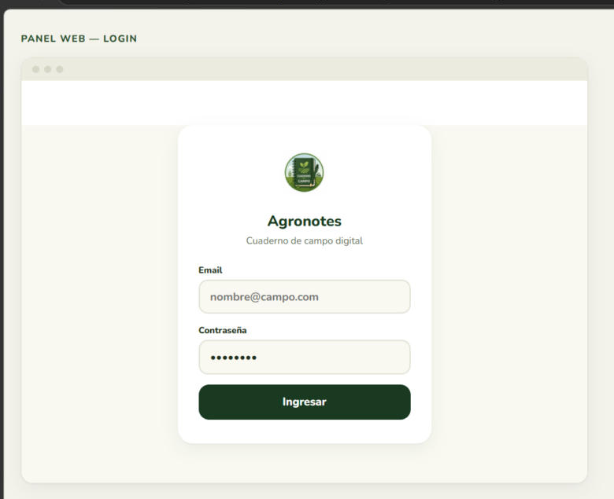
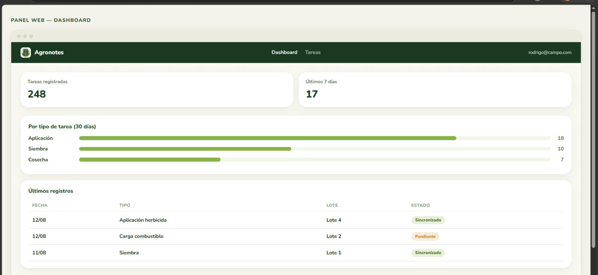
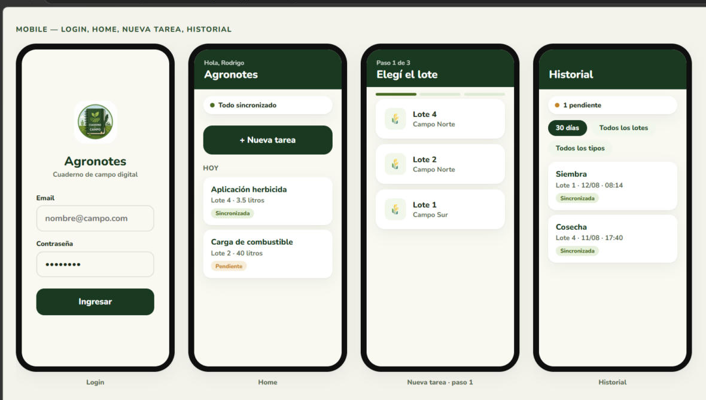

# Agronotes

**Cuaderno de campo digital.** App mobile offline-first para que encargados de campo registren tareas agropecuarias (aplicaciones, siembra, cosecha, carga de combustible) en 3 pasos, sin depender de señal.

Reemplaza las libretas de papel y los grupos de WhatsApp que hoy se usan para llevar este registro. Cada tarea se guarda al instante en el dispositivo y se sincroniza sola a un panel web ordenado apenas hay conexión, sin que el operario tenga que hacer nada extra ni perder el registro por falta de señal en el campo.

El panel web le da al administrador una vista consolidada de todo lo que se registra en sus campos: qué se hizo, dónde, cuándo y quién lo cargó, con filtros y exportación a CSV. Se vende por suscripción mensual fija por campo/administrador.

## Capturas de pantalla

*Mockups de la guía visual (paleta y tipografía extraídas del logo), usados para validar el diseño antes de implementarlo en código.*

**Panel web — Login**

**Panel web — Dashboard**

**Mobile — Login, Home, Nueva tarea, Historial**

